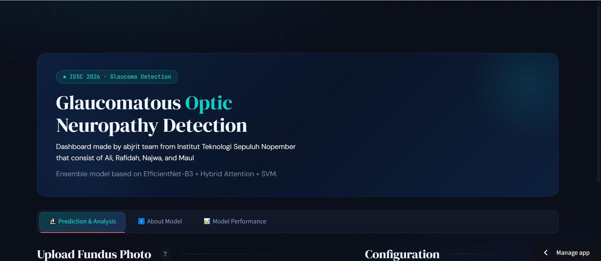

# GlaucoScan AI  
**Glaucoma GON Detection · IDSC 2026**

GlaucoScan AI is a deep learning–based diagnostic support system designed to detect **Glaucomatous Optic Neuropathy (GON)** from retinal fundus images.

This project combines **CNN feature extraction + machine learning fusion** to achieve highly robust performance while minimizing data leakage through patient-level validation.

**Live Dashboard**: https://glaucoscanidsc.streamlit.app  

---

## Key Features
- EfficientNet-B3 Backbone for image feature extraction  
- Late Fusion Strategy (Image + Quality Score)  
- SVM (RBF Kernel) for final classification  
- 5-Fold Patient-Level Cross Validation (no data leakage)  
- Interactive Streamlit Dashboard  
- Ensemble prediction from all folds  

---

## Model Architecture

Fundus Image  
↓  
EfficientNet-B3 (Feature Extractor)  
↓  
Image Quality Score (Late Fusion)  
↓  
SVM (RBF Kernel)  
↓  
Final Prediction (GON / Normal)  

---

## Project Structure

```
glaucoscan/
├── app.py                  
├── requirements.txt
├── assets/                 
│   ├── fold_results.csv
│   ├── history_fold0..4.png
│   ├── confusion_matrix_fold0..4.png
│   └── dev_set.csv, test_set.csv
└── streamlit_models/       
    ├── fold0_cnn.pth
    ├── fold0_svm.joblib
    ├── fold1_cnn.pth
    ├── fold1_svm.joblib
    ├── ... (until fold4)
    └── model_config.json
```

---

## Installation & Usage

### 1. Clone Repository
```
git clone https://github.com/alizainal953-creator/glaucoscan.app.git
cd glaucoscan.app
```

### Install Dependencies
```
pip install -r requirements.txt
```

### Prepare Model Files
Place all `.pth` and `.joblib` files into:
```
streamlit_models/
```

### Run Dashboard
```
streamlit run app.py
```

---

## Model Performance

| Fold | Validation AUC |
|------|---------------|
| 0    | 0.9966        |
| 1    | 0.9805        |
| 2    | 0.9986        |
| 3    | 0.9904        |
| 4    | 0.9478        |
| **Mean** | **0.9828 ± 0.0188** |

Ensemble across all folds improves robustness and generalization.

---

## Validation Strategy

We use Patient-Level K-Fold Split, ensuring:
- No data leakage between train & validation  
- Each patient appears in only one fold at a time  
- More realistic clinical evaluation  

---

## Dashboard Preview



---

## Tech Stack
- Python  
- PyTorch  
- Scikit-learn  
- Streamlit  
- EfficientNet  

---

## Author
- Ali Zainal Abidin
- Rafidah Khoirunnisa 
- Maulida Rahmi
- Najwa Fadhilah 

ITS Statistics Student · Data Enthusiast  

---

## Notes
This project was developed for IDSC 2026 and focuses on building a reliable AI-assisted screening tool for glaucoma detection.
